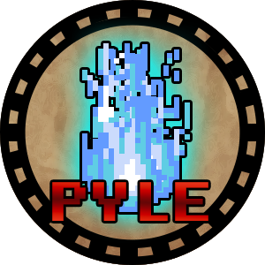

# Pyle - The Board Game

**Pyle** is an open-source board game where players take on the role of shamans striving to defeat a powerful demon threatening the Lake of Illusions. Through strategy, teamwork, and battles against spirits, players gather resources and unlock abilities to save both their world and the realm of spirits.

---

## Features

- **For 2-5 Players:** Perfect for small groups.
- **Tactical Gameplay:** Balance movement, combat, and resource management.
- **Customizable Setup:** Includes printable game components.
- **Replayable:** Randomized setup ensures a unique experience every time.
- **Open-Source:** Modify, adapt, and expand upon the game freely under the CC-BY-NC-SA license.

---

## Components

The self-print set includes:

- 5 player boards
- 5 player tokens
- 100 spirit tokens
- 25 event tokens
- 25 artifact tokens
- 1 game board
- 4 demon cards

You will also need (not included):
- At leas two 6-sided dice in different colors (we recommend 10 red and 10 green dice).

---

## How to Play

1. **Setup:** Lay out the game board, distribute player tokens, and shuffle tokens as per the instructions.
2. **Objective:** Defeat the demon before the boss counter reaches its limit.
3. **Gameplay:**
   - Move around the board and encounter spirits, events, and temples.
   - Collect spirit essence and artifacts to power up.
   - Engage in battles using dice and spirit abilities.
4. **Winning:** Work together to defeat the demon in an epic final battle!

---

## Getting Started

1. **Download the Files:** Clone or download the repository.
2. **Print and Prepare:** Print the provided game materials (player boards, tokens, and cards).
3. **Assemble Components:** Follow the instructions in the rules file for setup.
4. **Play:** Gather your friends and embark on your journey!

---

## Contributing

We welcome contributions from the community! Here are some ways you can help:

- Report bugs or inconsistencies in the game rules.
- Submit pull requests with your custom rules, components, or enhancements.
- Translate the game into other languages.

### How to Contribute

1. Fork the repository.
2. Create a branch for your changes.
3. Submit a pull request describing your modifications.

---

## License

Pyle is released under the **CC-BY-NC-SA 4.0 License**. You are free to share, remix, and adapt the game for non-commercial purposes, provided you attribute the original creators and share your contributions under the same license.

[Read the full license here.](https://creativecommons.org/licenses/by-nc-sa/4.0/)

---

## Acknowledgments

Special thanks to everyone who contributed to the development and playtesting of Pyle. Your feedback and support have been invaluable.

---

Enjoy the game, and may your shamanic journey be successful!
