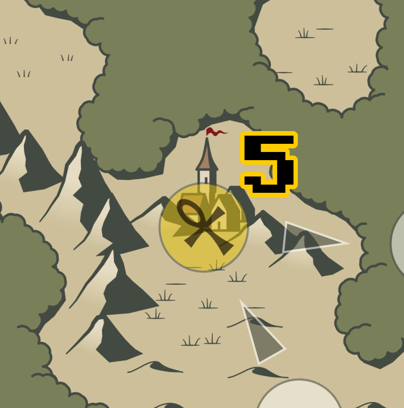
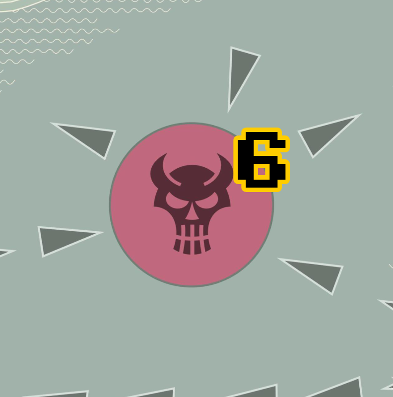
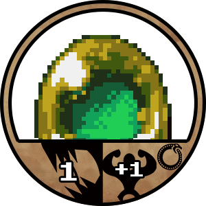

# Pyle

Ben Schröter - Thomas Marchewka - Björn Schmidt

Version 1

Dunkle Wolken sammeln sich über dem See der Illusionen. Eine unnatürliche Spannung liegt in der Luft, hier, wo die Grenze zwischen unserer Welt und der Welt der Geister verschwimmt. Das Wasser ist unruhig geworden, nur wenige Schiffe verlassen noch die Häfen. Überall hält das Unglück Einzug, von kleinen Sorgen bis zu großen Problemen. Während andere noch Rätseln, ist euch als Schamanen klar: ein Dämon hat den See besetzt. Und wenn er nicht bald aufgehalten wird, wird er beide Welten ins Chaos stürzen! Vielleicht können euch die alten Geister dieser Lande bei dieser Aufgabe unterstützen?

# Intro

Pyle ist ein Brettspiel für 2-5 Spieler\*innen. Ihr übernehmt die  Rolle von Schaman\*innen und müsst durch das Bekämpfen von Geistern genügend Geisteressenz sammeln, um den großen Dämonen zu besiegen, bevor die ganze Welt ins Unheil stürzt.

# Spielmaterial

Das Spiel steht als Selbstdruckset zur Verfügung. Es sind folgende Komponenten enthalten:

1.  5 Spielerboards
2.  5 Spieler-Token
3.  100 Geister-Token
4.  25 Ereignis-Token
5.  25 Artefakt-Token
6.  1 Spielbrett
7.  4 Dämonenkarten

Zusätzlich benötigt ihr (nicht bereitgestellt):

1.  Mindestens 2 verschiedenfarbige 6-seitige Würfel (2W6). Wir empfehlen 10 grüne und 10 rote Würfel. Im Rest der Anleitung gehen wir von diesen Farben aus.

# Aufbau zum Spielstart

1.  Legt das Spielbrett aus
2.  Legt alle Artefakt Token auf einem Extra-Stapel beiseite
3.  Legt alle Geister- und Ereignis-Token mit der (identischen) Rückseite nach oben in Reichweite neben das Spielbrett
4.  Mischt die Geister- und Ereignis-Token und legt aus dem entstandenen Stapel - ohne Anschauen - ein Token verdeckt auf jedes weiße Spielfeld
5.  Jede\*r Spieler\*in sucht sich eines der 4 Charakter-Dashboards aus und legt es vor sich ab
6.  Jede\*r Spieler\*in nimmt das zugehörige Spieler-Token und stellt es  auf das Startfeld

# Spielablauf

## Spielende

Das Spiel endet, wenn die Spieler\*innen den Dämon besiegen oder der Bosscounter das Limit erreicht hat.

## Spielbrett / Welt

Das Spielbrett zeigt:

-   Den aktuellen Standort von **Spieler\*innen** (1)**.**
-   Ein **verdecktes Token** (2) - hier weiß noch niemand, was sich versteckt! Beim Durchsuchen eines Feldes mit einem umgedrehten Token wird dieses auf seine Vorderseite gedreht.
-   (3) Hier wartet ein bereits entdeckter, aber noch unbesiegter **Geist** auf einen Kampf.
-   Ein **leeres Feld** (4). Wird üblicherweise mit einem umgedrehten Token (Geist/Event) bedeckt.
-   Auf **Tempelfeldern (5)** könnt Ihr Artefakte und Segen erhalten, die Ihr benötigt, um den Dämon zu besiegen.

-   Hier wartet der **Dämon (6)** auf Euch. Ist er besiegt, endet das Spiel und sein\*e Bezwinger\*in kann sich auf die Schulter klopfen!

## Regelgültigkeit

Die im Folgenden definierten Regeln bilden die Basis des Spiels. Ausgerüstete Geister oder Artefakte können diese Regeln ändern und haben Vorrang gegenüber den hier beschriebenen.

## Runden und Aktionen

Das Spiel findet in Runden statt, in der jede\*r Spieler\*in sich erst bewegt und dann je nach Zielfeld eine Begegnung abarbeitet. Ausnahmen sind Tempelfelder und das Dämonenfeld.

Einigt Euch auf eine\*n Startspieler\*in. Nach seinen\*ihren Aktionen geht es im Uhrzeigersinn reihum mit dem\*der nächsten weiter.

Mögliche Aktionen sind:

-   **Bewegen**
    -   In einer Bewegungsaktion könnt Ihr Eure Figur bis zu der Anzahl von Feldern in eine Richtung bewegen, die Eurem aktuellen Bewegungswert entspricht. Dieser berechnet sich aus Eurem **Grundwert von 2** und Boni (oder Mali) Eurer ausgerüsteten Geister (siehe “Spielerdashboards).
    -   Ihr könnt Euch nur auf den vorgegebenen Pfaden zwischen den Feldern bewegen, es sei denn, eine Fähigkeit sagt etwas anderes.
    -   Ihr könnt Euch entscheiden, wie viele Felder innerhalb Eures aktuellen Bewegungswertes Ihr Euch bewegen wollt, es muss aber mindestens 1 Feld sein. Ausnahme ist das Dämonenfeld.
-   **Geisterkampf**: Befindet sich ein aufgedecktes Geister-Token auf dem Feld, müsst ihr den Geist bekämpfen! Siehe dazu den Abschnitt “Kampf”.
-   **Geister tauschen**: Endet eure Bewegung auf einem Feld, auf dem eine andere Spielfigur steht, könnt ihr aktive Geister tauschen. Beide Spieler müssen mit dem Handel einverstanden sein und es kann nur jeweils ein aktiver Geist getauscht werden
-   **Tempel besuchen**: Steht Ihr auf einem Tempelfeld, könnt Ihr ein Artefakt erhalten. Mehr dazu im Abschnitt “Tempel”.

## Spieler\*innendashboards

Auf euren Dashboards sammelt ihr eure besiegten Geister und Artefakte, aus denen sich eure Geisteressenz und Fähigkeiten ableiten.

1.  **Geister** ( 4 Slots, Mitte): Hier könnt Ihr Eure aktiven / ausgerüsteten Geister ablegen, bis zu einem Maximum von 4. Siehe Kapitel “Geister”
2.  **Inventar** (3 Slots, Links): Hier könnt Ihr bis zu 3 Artefakte ablegen
3.  **Pyle / Geisteressenz** (Rechts): Besiegte Geister, die Ihr nicht ausrüsten wollt, wandern in den Pyle und stellen Eure Geisteressenz dar. Diese schützt Euch im Kampf gegen andere Geister und kann in Tempeln gegen Artefakte getauscht werden.

## Geister

Auf dem Spielbrett werdet Ihr gegen Geister kämpfen müssen, um besondere Fähigkeiten zu sammeln und Eure verfügbare Geisteressenz zu erhöhen. Verschiedene Geister verleihen Euch verschiedene Fähigkeiten, sobald Ihr sie besiegt und ausgerüstet habt.

### 

1.  Geisterkraft (links):  Gibt an, wie stark der Geist ist. Verwendet im Kampf so viele rote Würfel, wie hier angegeben ist
2.  Nutzbarkeit: Wenn Ihr diesen Geist aktiv ausgerüstet habt, beschreibt dieses Symbol, wie oft ihr seine Fähigkeit anwenden könnt.
    1.  entweder einmal pro Zug  (flippen)
    2.  oder einmalig (abwerfen)
3.  Fähigkeit: beeinflusst Kampf oder Aktionsmöglichkeiten (Übersicht in Kapitel “Fähigkeiten”)

|  |  |
| --- | --- |
| Die Fähigkeit kann in mehreren Kämpfen eingesetzt werden. | Die Fähigkeit kann einmal eingesetzt werden. Nachdem sie eingesetzt wurde, wird der Geist aus dem aktiven Bereich in den Pyle gelegt. |

## Kampf

Der Kampf gegen Geister ist Eure Gelegenheit, Geisteressenz zu sammeln oder Geister und ihre Fähigkeiten auf Eure Seite zu ziehen!

### Kampf gegen Geister

Steht Ihr auf einem Feld mit einem aufgedeckten Geist, könnt Ihr gegen ihn kämpfen!

Im Geister-Kampf wird innerhalb einer Runde entschieden, ob der Geist besiegt wird oder nicht. Ein Kampf läuft dabei so ab:

-   Die\*der Spieler\*in entscheidet, ob eine aktive Geisterfähigkeit eines ausgerüsteten Geistes eingesetzt werden soll. Es kann nur eine einzige Fähigkeit eingesetzt werden.
-   Der Spieler wirft so viele grüne Würfel, wie seiner Geisterkraft entsprechen. Die Geisteskraft eines Schamanen berechnet sich als: 2 + Anzahl aktiver, nicht umgedrehter Geister + Boni von aktivierten Fähigkeiten. Es wird die Summe der Würfel gebildet. Beispiel: Ein Spieler hat zwei aktive Geister und verwendet eine Fähigkeit, die einen Bonus von 2 gibt. Der Spieler aktiviert diese Fähigkeit und hat damit 5 grüne Würfel zur Verfügung (2 + 1 + 2).
-   Wenn der/die Spieler\*In Artefakte besitzt, kann jetzt entschieden werden, sie zu benutzen. Benutzte Artefakte werden wieder auf den Artefakt-Stapel gelegt.
-   Der Spieler wirft so viele rote Würfel, wie die Stärke des gegnerischen Geistes angibt. Es wird die Summe der Würfel gebildet.
-   Ist die Summe der roten Würfel gleich oder höher als die der grünen Würfel, entkommt der Geist und der Schamane wird verletzt. Der Pyle des Spielers wird um so viele Token reduziert, wie die Stärke des Geistes war. Sollte der Spieler nicht genügend Token haben und der Pyle auf 0 fallen, wird der Schamane zurück zum Startpunkt auf der Karte gesetzt. Hatte der Schamane einen Segen, verfällt dieser. Artefakte werden nicht zerstört.
-   Ist die Summe der roten Würfel niedriger als die der grünen Würfel, wurde der Geist besiegt. Der Spieler erhält das Token und entscheidet, ob er den Geist als aktiven Geist ausrüsten oder auf den Pyle legen will. Sollten bereits alle Slots für aktive Geister belegt sein, kann ein bereits aktiver Geist auf den Pyle gelegt werden, um den neuen Geist auszurüsten.
-   Alle aktiven Geister, deren Fähigkeit genutzt wurde, werden wieder umgedreht. Wenn ihre Fähigkeit in mehreren Kämpfen eingesetzt werden kann, verbleiben sie als aktive Geister. Kann sie nur einmal eingesetzt werden, wird der Geist auf den Pyle gelegt.
-   Wurde der Geist besiegt, wird ein neues Token mit der Rückseite nach oben auf das Feld gelegt (es kann also beim nächsten Mal ein weiterer Geist bekämpft werden).

## Der Dämon

Um das Spiel gewinnen, müsst Ihr den Dämonen besiegen! Dazu müsst ihr ihn in der Mitte des Sees herausfordern. Der Dämon kann nur von Schamanen herausgefordert werden, die zuvor in einem Tempel gesegnet wurden. Wird das Feld betreten, startet der Kampf automatisch.

Beim ersten Kampf zieht eine Karte vom Boss-Stapel, um den Dämon für dieses Spiel zu bestimmen. Die Karte zeigt:

-   wie viele rote Würfel ihr für den Dämon in jeder Runde werft (links)
-   wie viele Runden ihr den Dämonen besiegen müsst (rechts)
-   die Anzahl der Runden entspricht außerdem dem Grenzwert des Bosscounters

Der Kampf läuft nach den Regeln des Geisterkampfes ab, mit folgenden Änderungen:

-   Der Dämon hat mehr Lebenskraft als Geister. Er ist nicht nach nur einer Runde besiegt, sondern muss so oft besiegt werden, wie die rechte Zahl auf der Bosskarte vorgibt.
-   Verliert der\*die Spieler\*in eine Runde, muss er\*sie bis zur nächsten Runde warten, um es erneut zu probieren.
-   Der Dämon hat selbst Sonderfertigkeiten. Bevor der\*die Spieler\*in (sofern gewünscht) eine Geisterfähigkeit aktiviert, werden 3 Würfel geworfen. Die Summe der Würfel gibt die Fähigkeit dieser Runde an, die der Dämon verwendet, anhand der untenstehenden Tabelle an
-   Die Lebenspunkte und Fähigkeiten des Dämonen werden nach jedem Kampf zurückgesetzt. Die Karten für Dämonenfähigkeiten werden dann wieder neu gemischt.
-   Hat der Dämon keine Lebenspunkte mehr, hat der\*die Spieler\*in gewonnen und das Spiel endet.
-   Jedes Mal, wenn ein Schamane vom Dämonen besiegt wird, rückt die Welt dem Ende ein Stück näher. Sollte der Counter die Zahl erreichen, die unten rechts auf der Dämonenkarte angegeben ist, hat der Dämon das Spiel gewonnen.

| Würfelsumme | Fähigkeit |
| --- | --- |
| 3 | Verwendet in dieser Runde keine Fähigkeit |
| 4 | Verwendet in dieser Runde keine Fähigkeit |
| 5 | Entferne 1 grünen Würfel |
| 6 | Entferne 2 grüne Würfel |
| 7 | Jeder rote Würfel mit Augenzahl 1 wird erneut gewürfelt. Gilt einmal pro Würfel. |
| 8 | Jeder grüne Würfel mit Augenzahl 6 wird erneut gewürfelt. Gilt einmal pro Würfel. |
| 9 | Jeder rote Würfel mit Augenzahl 1 oder 2 wird erneut gewürfelt. Gilt einmal pro Würfel. |
| 10 | Verwendet in dieser Runde keine Fähigkeit |
| 11 | Verhindert den Einsatz von Fähigkeiten in dieser Runde |
| 12 | Verdeckt alle aufgedeckten Felder wieder |
| 13 | Entfernt dauerhaft einen Geist vom Pyle des Schamanen |
| 14 | Tauscht die Position zweier zufälliger Schamanen auf dem Spielfeld |
| 15 | Verwendet in dieser Runde keine Fähigkeit |
| 16 | Zerstört ein Artefakt des Schamanen |
| 17 | Entferne alle Würfel bis auf jeweils 1. Die Würfelanzahl kann in dieser Runde nicht durch andere Fähigkeiten beeinflusst werden |
| 18 | Erhöhe den Bosscounter um 1 |

## Tempel und Artefakte

Tempel sind feste Orte auf dem Spielbrett, an denen Spieler besondere Aktionen durchführen können. Ein Schamane wird beim Betreten des Tempels gesegnet. Nur Schamanen, die gesegnet wurden, haben die Möglichkeit, sich dem Dämon überhaupt zu stellen. 

Zusätzlich können in Tempeln **Artefakte** erworben werden, die den Schamanen stärken und entscheidenden Einfluss auf den Bosskampf haben können. Ein Artefakt kann im Kampf benutzt werden und erlaubt es dem Spieler, nach einem Würfelwurf eine beliebige Anzahl der Würfel erneut zu werfen.

Beispiel: Alice hat 4 Würfel geworfen. Das Ergebnis ist 6 + 4 + 1 + 1. Sie entscheidet sich dazu, ein Artefakt zu benutzen und die beiden 1en erneut zu werfen. Im zweiten Wurf hatte sie 5 + 1, also insgesamt 6 + 4 + 5 + 1. Das Artefakt wird wieder auf dem Artefakt-Stapel am Rand des Spielfelds belegt. Alice kann das Artefakt in einem Tempel erneut erwerben.

Das Erhalten von Artefakten fordert ein Opfer  – nämlich **2 Token** aus ihrem Pyle.

# Fähigkeiten

| **Symbol** | **Effekt** |
| --- | --- |
|  | Verwende so viele zusätzliche eigene Würfel, wie auf dem Symbol angegeben. Gilt für eine Runde. |
|  | Reduziere die Anzahl der gegnerischen Würfel um die auf dem Symbol angegebene Zahl. Gilt für eine Runde. |
|  | Erhöht die Reichweite einer Bewegungsaktion um 1. Hat keine Wirkung im Kampf und ist dauerhaft aktiv solange der Geist ausgerüstet ist. Mehrere Geister mit dieser Fähigkeit können ausgerüstet sein und erhöhen die Bewegungsreichweite jeweils um 1. |
|  | Sage vorher, ob rot oder grün höher ist. Liegst du richtig, gewinnst du die Runde |
|  | Opfere deine Bewegung und reise direkt zu einem beliebigen Feld deiner Wahl. Der Effekt des Feldes wird ausgelöst, als wenn du es normal betreten hast. |
|  | Halbiere die Anzahl der gegnerischen Würfel in dieser Runde. |
|  | Würfel erneut, wenn rot gewinnt und akzeptiere das neue Ergebnis |
|  | Verhindert den Einsatz von Spezialfähigkeiten in dieser Runde. |
|  | Entferne alle Würfel bis auf einen roten und einen grünen Würfel. |
|  | Besiege einen normalen Geist sofort oder gewinne eine Runde gegen den Dämonen. |

# Ereignisse:

Hin und wieder trifft man auf der Reise nicht nur auf Monster, sondern auch auf eine freundliche Person, die bereit ist zu helfen. Wenn ein Charakter ein Feld betritt, auf dem ein Ereignis-Token liegt, bietet die entsprechende Person ihre Hilfe an. Wenn ein Ereignis aktiviert wurde, wird es aus dem Spiel entfernt.

Folgende Personen können getroffen werden:

| Symbol | Name | Bedeutung |
| --- | --- | --- |
|  |Hellseher | Decke ein beliebiges Feld auf dem Brett auf, ohne es zu aktivieren |
|  | Schatzjäger | Erhalte ein Artefakt ohne Geister zu opfern |
|  | Exorzist | Entferne einen beliebigen aufgedeckten Geist vom Brett. Lege dafür ein neues verdecktes Token ab |
|  | Hexe | Verfluche einen anderen Spieler. Beim nächsten Kampf dieses Spielers befindet sich ein weiterer roter Stein im Beutel |
|  | Priesterin | Leiste einem anderen Spieler Beistand. Beim nächsten Kampf des Spielers befindet sich ein weiterer grüner Stein im Beutel |
|  | Händler | Tausche einen aktiven Geist mit einem aktiven Geist eines anderen Spielers. Der andere Spieler kann diesen Handel nicht ablehnen |
|  |Grabräuber | Tausche einen Geist von deinem Pyle mit einem deiner aktiven Geister |
|  |Reisende | In deinem nächsten Zug kannst du bis zu 2 Felder weiter laufen |
|  | Inquisitor | Opfere einen aktiven Geist und zerstöre den Segen eines Spielers deiner Wahl |
|  | Kriegsfürstin | Lege einen Tempel in Trümmer. In den nächsten 5 Runden kann niemand den Tempel betreten |
|  | Dieb | Nimm ein Siegel einer anderen Spielerin |

# Danksagungen

Vielen Dank an Isoboy, Tim, Paul, Chris, Matthias, Nikolai, foobar, Frederik, Alexandra, Benjamin, Atlan, Thomas, 151Pokemon, Nico, bOta85, Isogirl, Wracu,  Arina, Jenzen und Inês.

Ihr habt uns in den letzten 2 Jahren finanziell unterstützt, motiviert und uns Feedback gegeben. Ohne euch würde dieses Spiel nicht existieren. Danke!

# Lizenz

Veröffentlicht unter CC-BY-NC-SA Lizenz: [https://creativecommons.org/licenses/by-nc-sa/4.0/](https://creativecommons.org/licenses/by-nc-sa/4.0/)

Namensnennung-Nicht kommerziell-Share Alike 4.0 International

This license enables reusers to distribute, remix, adapt, and build upon the material in any medium or format for noncommercial purposes only, and only so long as attribution is given to the creator. If you remix, adapt, or build upon the material, you must license the modified material under identical terms.

# Credits

Für das Selbstdruck-Set dieses Spiels wurden unter anderem die folgenden Ressourcen verwendet:

-   Unter Public Domain Lizenz, CC0: [https://creativecommons.org/publicdomain/zero/1.0/](https://creativecommons.org/publicdomain/zero/1.0/)
    -   Dancing Girl Sprite: [https://opengameart.org/content/dancing-girl-sprites](https://opengameart.org/content/dancing-girl-sprites)
    -   Swamp Background: [https://opengameart.org/content/gotthicvania-swamp](https://opengameart.org/content/gotthicvania-swamp)
    -   Forest: [https://opengameart.org/content/sunnyland-forest-of-illusion](https://opengameart.org/content/sunnyland-forest-of-illusion)
    -   Cemetery: [https://opengameart.org/content/gothicvania-cemetery-pack](https://opengameart.org/content/gothicvania-cemetery-pack)
    -   Church: [https://opengameart.org/content/gothicvania-church-pack](https://opengameart.org/content/gothicvania-church-pack)
    -   Pixel font: [https://www.dafont.com/de/dogica.font](https://www.dafont.com/de/dogica.font)
    -   [https://game-icons.net/1x1/zeromancer/heart-plus.html](https://game-icons.net/1x1/zeromancer/heart-plus.html)
    -   [https://watabou.github.io/](https://watabou.github.io/)
    -   Wizard: [https://opengameart.org/content/wizard-0](https://opengameart.org/content/wizard-0)
-   Unter Lizenz CC3-BY: [https://creativecommons.org/licenses/by/3.0/](https://creativecommons.org/licenses/by/3.0/)
    -   [https://game-icons.net/1x1/lorc/ouroboros.html](https://game-icons.net/1x1/lorc/ouroboros.html)
    -   [https://game-icons.net/1x1/lorc/crossed-bones.html](https://game-icons.net/1x1/lorc/crossed-bones.html)
    -   [https://game-icons.net/1x1/lorc/crystal-ball.html](https://game-icons.net/1x1/lorc/crystal-ball.html)
    -   [https://game-icons.net/1x1/lorc/teleport.html](https://game-icons.net/1x1/lorc/teleport.html)
    -   [https://game-icons.net/1x1/lorc/stick-splitting.html](https://game-icons.net/1x1/lorc/stick-splitting.html)
    -   [https://game-icons.net/1x1/delapouite/duration.htm](https://game-icons.net/1x1/delapouite/duration.htm)
    -   [https://game-icons.net/1x1/lorc/bolt-eye.html](https://game-icons.net/1x1/lorc/bolt-eye.html)
    -   [https://game-icons.net/1x1/sbed/duel.html](https://game-icons.net/1x1/sbed/duel.html)
    -   [https://game-icons.net/1x1/lorc/broken-heart-zone.html](https://game-icons.net/1x1/lorc/broken-heart-zone.html)
    -   [https://game-icons.net/1x1/lorc/ankh.html](https://game-icons.net/1x1/lorc/ankh.html)
    -   [https://game-icons.net/1x1/lorc/ghost.html](https://game-icons.net/1x1/lorc/ghost.html)
    -   [https://game-icons.net/1x1/delapouite/stack.html](https://game-icons.net/1x1/delapouite/stack.html)
    -   [https://game-icons.net/1x1/delapouite/monk-face.html](https://game-icons.net/1x1/delapouite/monk-face.html)
    -   [https://game-icons.net/1x1/delapouite/eye-target.html](https://game-icons.net/1x1/delapouite/eye-target.html)
    -   [https://game-icons.net/1x1/lorc/witch-flight.html](https://game-icons.net/1x1/lorc/witch-flight.html)
    -   [https://game-icons.net/1x1/delapouite/sun-priest.html](https://game-icons.net/1x1/delapouite/sun-priest.html)
    -   [https://game-icons.net/1x1/lorc/trade.html](https://game-icons.net/1x1/lorc/trade.html)
    -   [https://game-icons.net/1x1/skoll/hasty-grave.html](https://game-icons.net/1x1/skoll/hasty-grave.html)
    -   [https://game-icons.net/1x1/cathelineau/flying-trout.html](https://game-icons.net/1x1/cathelineau/flying-trout.html)
    -   [https://game-icons.net/1x1/lorc/flaming-trident.html](https://game-icons.net/1x1/lorc/flaming-trident.html)
    -   [https://game-icons.net/1x1/caro-asercion/warlord-helmet.html](https://game-icons.net/1x1/caro-asercion/warlord-helmet.html)
    -   [https://game-icons.net/1x1/lorc/body-swapping.html](https://game-icons.net/1x1/lorc/body-swapping.html)
    -   [https://game-icons.net/1x1/delapouite/coal-pile.html](https://game-icons.net/1x1/delapouite/coal-pile.html)
    -   [https://game-icons.net/1x1/lorc/daemon-skull.html](https://game-icons.net/1x1/lorc/daemon-skull.html)
    -   [https://game-icons.net/1x1/lorc/bleeding-heart.html](https://game-icons.net/1x1/lorc/bleeding-heart.html)
    -   [https://game-icons.net/1x1/lorc/nothing-to-say.html](https://game-icons.net/1x1/lorc/nothing-to-say.html)
    -   [https://game-icons.net/1x1/lorc/entangled-typhoon.html](https://game-icons.net/1x1/lorc/entangled-typhoon.html)
    -   [https://game-icons.net/1x1/skoll/breaking-chain.html](https://game-icons.net/1x1/skoll/breaking-chain.html)
    -   [https://game-icons.net/1x1/lorc/deadly-strike.html](https://game-icons.net/1x1/lorc/deadly-strike.html)
    -   [https://game-icons.net/1x1/lorc/cowled.html](https://game-icons.net/1x1/lorc/cowled.html)
    -   [https://game-icons.net/1x1/lorc/treasure-map.html](https://game-icons.net/1x1/lorc/treasure-map.html)
    -   [https://opengameart.org/content/js-monster-pack-4-ascent](https://opengameart.org/content/js-monster-pack-4-ascent)
    -   [https://opengameart.org/content/lpc-in-battle-rpg-sprites](https://opengameart.org/content/lpc-in-battle-rpg-sprites)
    -   [https://opengameart.org/content/js-monster-set-elementals](https://opengameart.org/content/js-monster-set-elementals)
    -   [https://opengameart.org/content/js-monsters-aeon-monsters-i](https://opengameart.org/content/js-monsters-aeon-monsters-i)
    -   [https://opengameart.org/content/js-monster-set-elementals-ii](https://opengameart.org/content/js-monster-set-elementals-ii)
    -   [https://opengameart.org/content/rpg-enemies-11-dragons](https://opengameart.org/content/rpg-enemies-11-dragons)
    -   [https://opengameart.org/content/bosses-and-monsters-spritesheets-ars-notoria](https://opengameart.org/content/bosses-and-monsters-spritesheets-ars-notoria)
    -   [https://opengameart.org/content/sotrak-rewop](https://opengameart.org/content/sotrak-rewop)
    -   [https://opengameart.org/content/chevalier](https://opengameart.org/content/chevalier)
