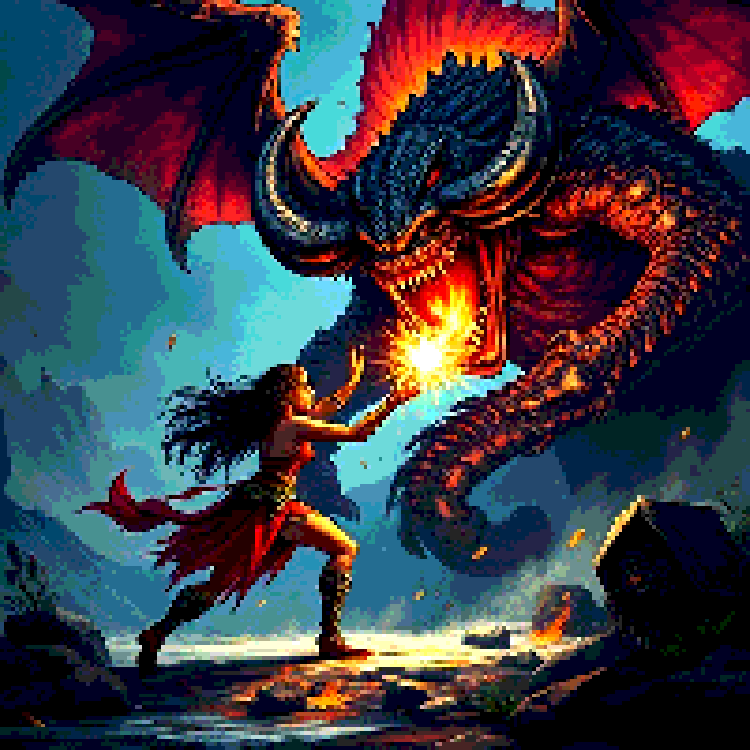
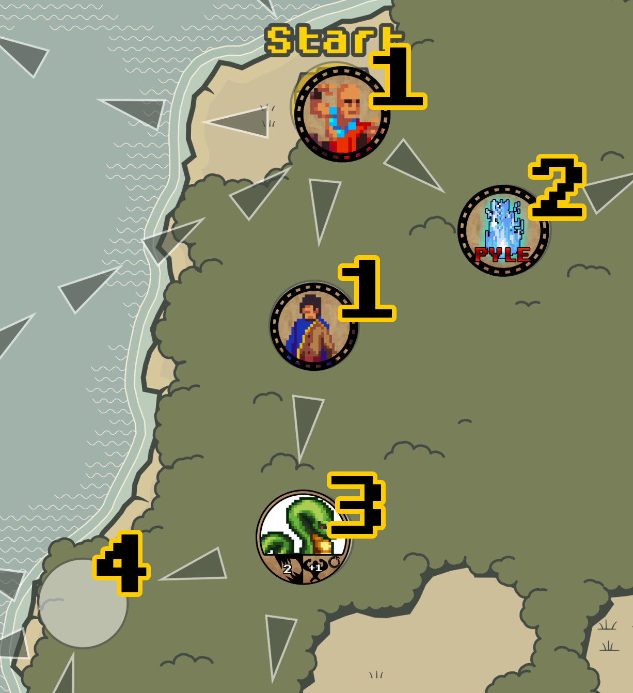
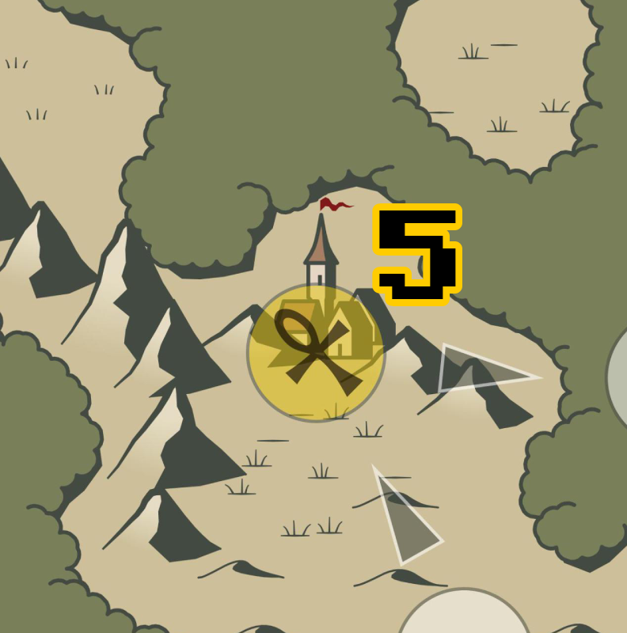
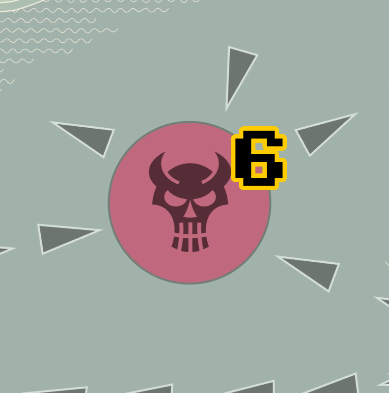
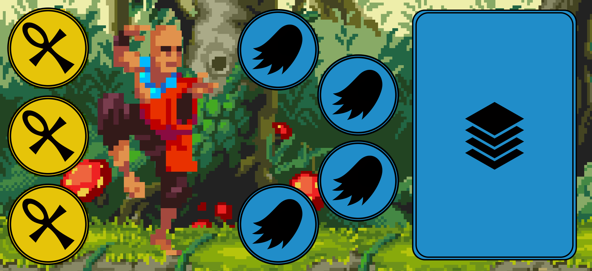
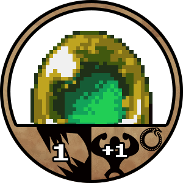
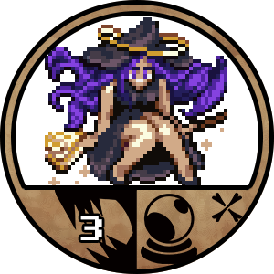

# Pyle

Ben Schröter - Thomas Marchewka - Björn Schmidt

Version 1

Dark clouds gather over the Lake of Illusions. An unnatural tension fills the air, here where the boundary between our world and the world of spirits blurs. The waters have grown restless, and few ships leave the harbor. Misfortune spreads everywhere, from minor worries to great troubles. While others still wonder, you, as shamans, know: a demon has occupied the lake. If it is not stopped soon, it will plunge both worlds into chaos! Perhaps the ancient spirits of this land can assist you in this task?

# Introduction

Pyle is a board game for 2-5 players. You take on the roles of shamans and must collect enough spirit essence by defeating spirits to vanquish the great demon before the entire world falls into ruin.

# Game Components

The game is available as a self-print set. The following components are included:

1.  5 player boards
2.  5 player tokens
3.  100 spirit tokens
4.  25 event tokens
5.  25 artifact tokens
6.  1 game board
7.  4 demon cards

Additionally, you will need (not included):

1. At least two six-sided dice (2d6) in different colors. We recommend 10 green and 10 red dice. For the rest of the manual, we will assume these colors.

# Setup

1. Lay out the game board.
2. Set aside all artifact tokens in a separate pile.
3. Place all spirit and event tokens face down (with the same back) within reach, next to the game board.
4. Shuffle the spirit and event tokens and place one token face down on each white field on the board without looking.
5. Each player selects one of the four character dashboards and places it in front of them.
6. Each player takes the corresponding player token and places it on the starting field.

# Gameplay

## End of the Game

The game ends when the players defeat the demon or the boss counter reaches its limit.

## Game Board / World

The game board displays:

-   The current location of **players** (1).
-   A **face-down token** (2) - no one knows what it hides yet! Searching a field with a face-down token flips it over.
-   (3) A revealed but undefeated **spirit** awaiting combat.
-   An **empty field** (4). Usually covered with a face-down token (spirit/event).
-   On **temple fields (5)**, you can obtain artifacts and blessings needed to defeat the demon.
-   Here waits the **demon (6)**. Once defeated, the game ends, and the victor can celebrate!

## Rules Validity

The rules defined below form the basis of the game. Equipped spirits or artifacts can alter these rules and take precedence over those described here.

## Rounds and Actions

The game is played in rounds. Each player first moves and then resolves an encounter based on their destination field. Exceptions are temple fields and the demon field.

Decide on a starting player. After their actions, the next player takes their turn in clockwise order.

Possible actions are:

-   **Movement**
    -   During a movement action, you can move your figure up to the number of fields equal to your current movement value. This value is calculated as your **base value of 2** plus bonuses (or penalties) from equipped spirits (see “Player Dashboards”).
    -   You can only move along the predetermined paths between fields unless a special ability states otherwise.
    -   You can decide how many fields to move within your movement value but must move at least one field. The demon field is an exception.
-   **Spirit Combat**: If a revealed spirit token is on the field, you must fight the spirit! See the “Combat” section.
-   **Trading Spirits**: If your movement ends on a field occupied by another player, you can trade active spirits. Both players must agree to the trade, and only one active spirit can be exchanged.
-   **Visiting a Temple**: If you stand on a temple field, you can obtain an artifact. More details in the “Temple” section.

## Player Dashboards

Your dashboards hold your defeated spirits and artifacts, which determine your spirit essence and abilities.

1.  **Spirits** (4 slots, middle): Place your active/equipped spirits here, up to a maximum of four. See the “Spirits” chapter.
2.  **Inventory** (3 slots, left): Store up to three artifacts here.
3.  **Pyle / Spirit Essence** (right): Defeated spirits you choose not to equip go into the Pyle, representing your spirit essence. This essence protects you in combat and can be traded for artifacts at temples.

## Spirits

On the game board, you will face spirits to gain special abilities and increase your available spirit essence. Different spirits grant various abilities once defeated and equipped.

### 

1.  Spirit Strength (left): Indicates the strength of the spirit. Use as many red dice as indicated in combat.
2.  Usage: Describes how often this spirit’s ability can be used when equipped:
    1. Once per turn (flip the token).
    2. One-time use (discard after use).
3.  Ability: Affects combat or action options (see “Abilities” chapter for details).

|  |  |
| --- | --- |
| The ability can be used in multiple combats. | The ability can be used once. After use, the spirit is moved to the Pyle. |

## Combat

Battles against spirits are your opportunity to collect spirit essence or recruit spirits and their abilities to your side!

### Combat Against Spirits

If you stand on a field with a revealed spirit, you can fight it! Combat is resolved in one round to determine if the spirit is defeated. Here’s how combat works:

