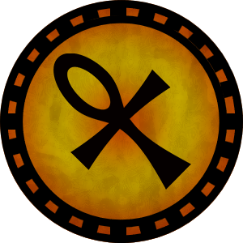
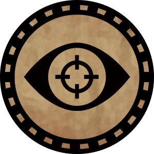
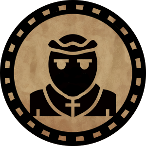

# Pyle

Ben Schröter - Thomas Marchewka - Björn Schmidt

Version 1

Dark clouds gather over the Lake of Illusions. An unnatural tension fills the air, here where the boundary between our world and the world of spirits blurs. The waters have grown restless, and few ships leave the harbor. Misfortune spreads everywhere, from minor worries to great troubles. While others still wonder, you, as shamans, know: a demon has occupied the lake. If it is not stopped soon, it will plunge both worlds into chaos! Perhaps the ancient spirits of this land can assist you in this task?

# Introduction

Pyle is a board game for 2-5 players. You take on the roles of shamans and must collect enough spirit essence by defeating spirits to vanquish the great demon before the entire world falls into ruin.

# Game Components

The game is available as a self-print set. The following components are included:

1.  5 player boards
2.  5 player tokens
3.  100 spirit tokens
4.  25 event tokens
5.  25 artifact tokens
6.  1 game board
7.  4 demon cards

Additionally, you will need (not included):

1. At least two six-sided dice (2d6) in different colors. We recommend 10 green and 10 red dice. For the rest of the manual, we will assume these colors.

# Setup

1. Lay out the game board.
2. Set aside all artifact tokens in a separate pile.
3. Place all spirit and event tokens face down (with the same back) within reach, next to the game board.
4. Shuffle the spirit and event tokens and place one token face down on each white field on the board without looking.
5. Each player selects one of the four character dashboards and places it in front of them.
6. Each player takes the corresponding player token and places it on the starting field.

# Gameplay

## End of the Game

The game ends when the players defeat the demon or the boss counter reaches its limit.

## Game Board / World

The game board displays:

-   The current location of **players** (1).
-   A **face-down token** (2) - no one knows what it hides yet! Searching a field with a face-down token flips it over.
-   (3) A revealed but undefeated **spirit** awaiting combat.
-   An **empty field** (4). Usually covered with a face-down token (spirit/event).
-   On **temple fields (5)**, you can obtain artifacts and blessings needed to defeat the demon.
-   Here waits the **demon (6)**. Once defeated, the game ends, and the victor can celebrate!

## Rules Validity

The rules defined below form the basis of the game. Equipped spirits or artifacts can alter these rules and take precedence over those described here.

## Rounds and Actions

The game is played in rounds. Each player first moves and then resolves an encounter based on their destination field. Exceptions are temple fields and the demon field.

Decide on a starting player. After their actions, the next player takes their turn in clockwise order.

Possible actions are:

-   **Movement**
    -   During a movement action, you can move your figure up to the number of fields equal to your current movement value. This value is calculated as your **base value of 2** plus bonuses (or penalties) from equipped spirits (see “Player Dashboards”).
    -   You can only move along the predetermined paths between fields unless a special ability states otherwise.
    -   You can decide how many fields to move within your movement value but must move at least one field. The demon field is an exception.
-   **Spirit Combat**: If a revealed spirit token is on the field, you must fight the spirit! See the “Combat” section.
-   **Trading Spirits**: If your movement ends on a field occupied by another player, you can trade active spirits. Both players must agree to the trade, and only one active spirit can be exchanged.
-   **Visiting a Temple**: If you stand on a temple field, you can obtain an artifact. More details in the “Temple” section.

## Player Dashboards

Your dashboards hold your defeated spirits and artifacts, which determine your spirit essence and abilities.

1.  **Spirits** (4 slots, middle): Place your active/equipped spirits here, up to a maximum of four. See the “Spirits” chapter.
2.  **Inventory** (3 slots, left): Store up to three artifacts here.
3.  **Pyle / Spirit Essence** (right): Defeated spirits you choose not to equip go into the Pyle, representing your spirit essence. This essence protects you in combat and can be traded for artifacts at temples.

## Spirits

On the game board, you will face spirits to gain special abilities and increase your available spirit essence. Different spirits grant various abilities once defeated and equipped.

### 

1.  Spirit Strength (left): Indicates the strength of the spirit. Use as many red dice as indicated in combat.
2.  Usage: Describes how often this spirit’s ability can be used when equipped:
    1. Once per turn (flip the token).
    2. One-time use (discard after use).
3.  Ability: Affects combat or action options (see “Abilities” chapter for details).

|  |  |
| --- | --- |
| The ability can be used in multiple combats. | The ability can be used once. After use, the spirit is moved to the Pyle. |

## Combat

Battles against spirits are your opportunity to collect spirit essence or recruit spirits and their abilities to your side!

### Combat Against Spirits

If you stand on a field with a revealed spirit, you can fight it! Combat is resolved in one round to determine if the spirit is defeated. Here’s how combat works:

-   The player decides whether to use an active spirit ability from an equipped spirit. Only one ability can be used per combat.
-   The player rolls as many green dice as their spirit strength allows. Spirit strength is calculated as: 2 + number of active (not flipped) spirits + bonuses from activated abilities. The sum of the dice is calculated. Example: A player has two active spirits and uses an ability that provides a bonus of 2. The player activates this ability, granting them 5 green dice (2 + 1 + 2).
-   If the player has artifacts, they may decide to use them now. Used artifacts are returned to the artifact pile.
-   The player rolls as many red dice as the opposing spirit’s strength. The sum of the dice is calculated.
-   If the sum of the red dice is equal to or greater than the sum of the green dice, the spirit escapes, and the shaman is injured. The player’s Pyle is reduced by a number of tokens equal to the spirit’s strength. If the player does not have enough tokens and their Pyle reaches 0, the shaman is returned to the starting point on the map. Any blessings are lost, but artifacts remain intact.
-   If the sum of the red dice is less than the sum of the green dice, the spirit is defeated. The player takes the token and decides whether to equip the spirit as an active spirit or place it in the Pyle. If all slots for active spirits are full, an active spirit can be moved to the Pyle to equip the new spirit.
-   All active spirits whose abilities were used are flipped. If their ability can be used in multiple combats, they remain active. If the ability is single-use, the spirit is moved to the Pyle.
-   If the spirit is defeated, a new token is placed face down on the field (another spirit may appear there later).

### The Demon

To win the game, you must defeat the demon! The demon resides in the center of the lake and can only be challenged by shamans who have been blessed at a temple. Entering the demon’s field automatically starts the battle.

At the start of the battle, draw a card from the boss deck to determine the demon for this game. The card indicates:

-   How many red dice the demon uses each round (left).
-   How many rounds the demon must be defeated in (right).
-   The number of rounds also represents the boss counter limit.

The combat follows the same rules as spirit combat, with the following differences:

-   The demon has more health than spirits. It must be defeated as many times as indicated on the right side of the boss card.
-   If the player loses a round, they must wait until the next round to try again.
-   The demon has its own special abilities. Before the player (if desired) activates a spirit ability, roll 3 dice. The sum determines the demon’s ability for that round based on the table below.
-   The demon’s health and abilities reset after each combat. The cards for demon abilities are reshuffled.
-   If the demon’s health is reduced to 0, the player wins, and the game ends.
-   Each time a shaman is defeated by the demon, the world edges closer to doom. If the counter reaches the number shown at the bottom right of the demon card, the demon wins the game.

| Dice Sum | Ability |
| --- | --- |
| 3 | Does not use an ability this round. |
| 4 | Does not use an ability this round. |
| 5 | Remove 1 green die. |
| 6 | Remove 2 green dice. |
| 7 | All red dice showing 1 are rerolled. Applies once per die. |
| 8 | All green dice showing 6 are rerolled. Applies once per die. |
| 9 | All red dice showing 1 or 2 are rerolled. Applies once per die. |
| 10 | Does not use an ability this round. |
| 11 | Prevents the use of abilities this round. |
| 12 | Covers all revealed fields again. |
| 13 | Permanently removes one spirit from the player’s Pyle. |
| 14 | Swaps the positions of two random shamans on the board. |
| 15 | Does not use an ability this round. |
| 16 | Destroys one artifact belonging to the player. |
| 17 | Removes all dice except one red and one green. Dice counts cannot be influenced by other abilities this round. |
| 18 | Increases the boss counter by 1. |

### Temples and Artifacts

Temples are fixed locations on the board where players can perform special actions. A shaman is blessed upon entering the temple. Only blessed shamans can challenge the demon. 

Additionally, temples allow players to acquire **artifacts** that strengthen shamans and can have a decisive impact on the boss fight. An artifact can be used in combat to reroll any number of dice after rolling.

Example: Alice rolls 4 dice. The result is 6 + 4 + 1 + 1. She decides to use an artifact to reroll the two 1s. On the second roll, she gets 5 + 1, so her total is 6 + 4 + 5 + 1. The artifact is returned to the artifact pile on the edge of the board. Alice can acquire the artifact again at a temple.

Obtaining artifacts requires a sacrifice – **2 tokens** from the player’s Pyle.

# Abilities

| **Symbol** | **Effect** |
| --- | --- |
|  | Use as many additional own dice as indicated on the symbol. Applies for one round. |
|  | Reduce the number of opponent’s dice by the number indicated on the symbol. Applies for one round. |
|  | Increases the range of a movement action by 1. Does not affect combat and is active as long as the spirit is equipped. Multiple spirits with this ability can be equipped, and their effects stack. |
|  | Predict whether green or red will have a higher sum. If correct, you win the round. |
|  | Sacrifice your movement to travel directly to any field of your choice. The field’s effect is triggered as if entered normally. |
|  | Halve the number of opponent’s dice for this round. |
|  | Reroll if red wins and accept the new result. |
|  | Prevents the use of special abilities this round. |
|  | Remove all dice except for one red and one green die. |
|  | Instantly defeat a normal spirit or win one round against the demon. |

# Events

Occasionally, you will encounter friendly individuals on your journey who are willing to help. When a character enters a field with an event token, the corresponding person offers their assistance. Once an event is activated, it is removed from the game.

The following people can be encountered:

| Symbol | Name | Effect |
| --- | --- | --- |
|  | Seer | Reveal any field on the board without activating it. |
|  | Treasure Hunter | Receive an artifact without sacrificing spirits. |
|  | Exorcist | Remove any revealed spirit from the board. Replace it with a new face-down token. |
|  | Witch | Curse another player. In their next combat, an additional red die is added to the pool. |
|  | Priestess | Aid another player. In their next combat, an additional green die is added to the pool. |
|  | Trader | Swap an active spirit with an active spirit of another player. The other player cannot refuse the trade. |
|  | Grave Robber | Swap a spirit from your Pyle with one of your active spirits. |
|  | Traveler | In your next turn, you can move up to 2 additional fields. |
|  | Inquisitor | Sacrifice an active spirit and destroy the blessing of a player of your choice. |
|  | Warlord | Lay a temple in ruins. For the next 5 rounds, no one can enter the temple. |
|  | Thief | Steal a seal from another player. |

# Acknowledgments

Many thanks to Isoboy, Tim, Paul, Chris, Matthias, Nikolai, foobar, Frederik, Alexandra, Benjamin, Atlan, Thomas, 151Pokemon, Nico, bOta85, Isogirl, Wracu, Arina, Jenzen, and Inês.

You have supported, motivated, and provided us with feedback over the past two years. Without you, this game would not exist. Thank you!

# License

Published under the CC-BY-NC-SA license: [https://creativecommons.org/licenses/by-nc-sa/4.0/](https://creativecommons.org/licenses/by-nc-sa/4.0/)

Attribution-NonCommercial-ShareAlike 4.0 International

This license enables reusers to distribute, remix, adapt, and build upon the material in any medium or format for noncommercial purposes only, and only so long as attribution is given to the creator. If you remix, adapt, or build upon the material, you must license the modified material under identical terms.

# Credits

For the self-print set of this game, the following resources were used, among others:

-   Public Domain License, CC0: [https://creativecommons.org/publicdomain/zero/1.0/](https://creativecommons.org/publicdomain/zero/1.0/)
    -   Dancing Girl Sprite: [https://opengameart.org/content/dancing-girl-sprites](https://opengameart.org/content/dancing-girl-sprites)
    -   Swamp Background: [https://opengameart.org/content/gotthicvania-swamp](https://opengameart.org/content/gotthicvania-swamp)
    -   Forest: [https://opengameart.org/content/sunnyland-forest-of-illusion](https://opengameart.org/content/sunnyland-forest-of-illusion)
    -   Cemetery: [https://opengameart.org/content/gothicvania-cemetery-pack](https://opengameart.org/content/gothicvania-cemetery-pack)
    -   Church: [https://opengameart.org/content/gothicvania-church-pack](https://opengameart.org/content/gothicvania-church-pack)
    -   Pixel font: [https://www.dafont.com/de/dogica.font](https://www.dafont.com/de/dogica.font)
    -   [https://game-icons.net/1x1/zeromancer/heart-plus.html](https://game-icons.net/1x1/zeromancer/heart-plus.html)
    -   [https://watabou.github.io/](https://watabou.github.io/)
    -   Wizard: [https://opengameart.org/content/wizard-0](https://opengameart.org/content/wizard-0)
-   Unter Lizenz CC3-BY: [https://creativecommons.org/licenses/by/3.0/](https://creativecommons.org/licenses/by/3.0/)
    -   [https://game-icons.net/1x1/lorc/ouroboros.html](https://game-icons.net/1x1/lorc/ouroboros.html)
    -   [https://game-icons.net/1x1/lorc/crossed-bones.html](https://game-icons.net/1x1/lorc/crossed-bones.html)
    -   [https://game-icons.net/1x1/lorc/crystal-ball.html](https://game-icons.net/1x1/lorc/crystal-ball.html)
    -   [https://game-icons.net/1x1/lorc/teleport.html](https://game-icons.net/1x1/lorc/teleport.html)
    -   [https://game-icons.net/1x1/lorc/stick-splitting.html](https://game-icons.net/1x1/lorc/stick-splitting.html)
    -   [https://game-icons.net/1x1/delapouite/duration.htm](https://game-icons.net/1x1/delapouite/duration.htm)
    -   [https://game-icons.net/1x1/lorc/bolt-eye.html](https://game-icons.net/1x1/lorc/bolt-eye.html)
    -   [https://game-icons.net/1x1/sbed/duel.html](https://game-icons.net/1x1/sbed/duel.html)
    -   [https://game-icons.net/1x1/lorc/broken-heart-zone.html](https://game-icons.net/1x1/lorc/broken-heart-zone.html)
    -   [https://game-icons.net/1x1/lorc/ankh.html](https://game-icons.net/1x1/lorc/ankh.html)
    -   [https://game-icons.net/1x1/lorc/ghost.html](https://game-icons.net/1x1/lorc/ghost.html)
    -   [https://game-icons.net/1x1/delapouite/stack.html](https://game-icons.net/1x1/delapouite/stack.html)
    -   [https://game-icons.net/1x1/delapouite/monk-face.html](https://game-icons.net/1x1/delapouite/monk-face.html)
    -   [https://game-icons.net/1x1/delapouite/eye-target.html](https://game-icons.net/1x1/delapouite/eye-target.html)
    -   [https://game-icons.net/1x1/lorc/witch-flight.html](https://game-icons.net/1x1/lorc/witch-flight.html)
    -   [https://game-icons.net/1x1/delapouite/sun-priest.html](https://game-icons.net/1x1/delapouite/sun-priest.html)
    -   [https://game-icons.net/1x1/lorc/trade.html](https://game-icons.net/1x1/lorc/trade.html)
    -   [https://game-icons.net/1x1/skoll/hasty-grave.html](https://game-icons.net/1x1/skoll/hasty-grave.html)
    -   [https://game-icons.net/1x1/cathelineau/flying-trout.html](https://game-icons.net/1x1/cathelineau/flying-trout.html)
    -   [https://game-icons.net/1x1/lorc/flaming-trident.html](https://game-icons.net/1x1/lorc/flaming-trident.html)
    -   [https://game-icons.net/1x1/caro-asercion/warlord-helmet.html](https://game-icons.net/1x1/caro-asercion/warlord-helmet.html)
    -   [https://game-icons.net/1x1/lorc/body-swapping.html](https://game-icons.net/1x1/lorc/body-swapping.html)
    -   [https://game-icons.net/1x1/delapouite/coal-pile.html](https://game-icons.net/1x1/delapouite/coal-pile.html)
    -   [https://game-icons.net/1x1/lorc/daemon-skull.html](https://game-icons.net/1x1/lorc/daemon-skull.html)
    -   [https://game-icons.net/1x1/lorc/bleeding-heart.html](https://game-icons.net/1x1/lorc/bleeding-heart.html)
    -   [https://game-icons.net/1x1/lorc/nothing-to-say.html](https://game-icons.net/1x1/lorc/nothing-to-say.html)
    -   [https://game-icons.net/1x1/lorc/entangled-typhoon.html](https://game-icons.net/1x1/lorc/entangled-typhoon.html)
    -   [https://game-icons.net/1x1/skoll/breaking-chain.html](https://game-icons.net/1x1/skoll/breaking-chain.html)
    -   [https://game-icons.net/1x1/lorc/deadly-strike.html](https://game-icons.net/1x1/lorc/deadly-strike.html)
    -   [https://game-icons.net/1x1/lorc/cowled.html](https://game-icons.net/1x1/lorc/cowled.html)
    -   [https://game-icons.net/1x1/lorc/treasure-map.html](https://game-icons.net/1x1/lorc/treasure-map.html)
    -   [https://opengameart.org/content/js-monster-pack-4-ascent](https://opengameart.org/content/js-monster-pack-4-ascent)
    -   [https://opengameart.org/content/lpc-in-battle-rpg-sprites](https://opengameart.org/content/lpc-in-battle-rpg-sprites)
    -   [https://opengameart.org/content/js-monster-set-elementals](https://opengameart.org/content/js-monster-set-elementals)
    -   [https://opengameart.org/content/js-monsters-aeon-monsters-i](https://opengameart.org/content/js-monsters-aeon-monsters-i)
    -   [https://opengameart.org/content/js-monster-set-elementals-ii](https://opengameart.org/content/js-monster-set-elementals-ii)
    -   [https://opengameart.org/content/rpg-enemies-11-dragons](https://opengameart.org/content/rpg-enemies-11-dragons)
    -   [https://opengameart.org/content/bosses-and-monsters-spritesheets-ars-notoria](https://opengameart.org/content/bosses-and-monsters-spritesheets-ars-notoria)
    -   [https://opengameart.org/content/sotrak-rewop](https://opengameart.org/content/sotrak-rewop)
    -   [https://opengameart.org/content/chevalier](https://opengameart.org/content/chevalier)
